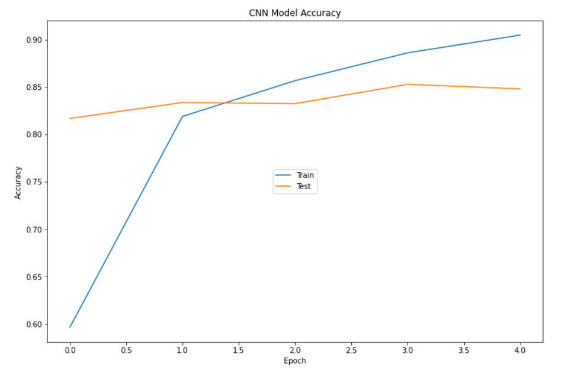

# Data Scientist Nanodegree: Capstone (What Dog Do You Look Like?)


The purpose of this project is to use a convolutional neural network (CNN) to predict dog breeds. The final pipeline code evaluates if an image is a dog or a human; if a dog, predicts a breed; and if a human face tells what dog breed the person most resembles. 

How I proceeded exactly and what results I achieved can be read in my blog post: [What Dog Do You Look Like?](https://medium.com/@tragoes/38cb55cce966)


## Table of Contents
1. [Introduction](#introduction)
2. [Hardware and Software Requirements](#hard_soft_requirements)
3. [Folder](#folders)
4. [Getting Started](#getting_started)
5. [Running dog_app_pipeline](#run_app_pipeline)
    1. [Detect Humans Face](#detect_humans_face)
    1. [Get InceptionV3 Model Trained](#run_dog_app)
    2. [Classify Dog Breeds](#classify_dog_breeds)
6. [Results](#results)    
7. [Author](#author)
8. [Project Motivation](#motivation)
9. [Acknowledgements](#acknowledgement)


<a name="introduction"></a>

## Introduction

This is the Udacity Capstone Project for the Data Science NanoDegree (DSND). The challenge is to identify whether an image is a dog or a human. If a dog, to classify the breed. If a human, to suggest what breed looks most similar to the person's face. It is often said that dogs look like their owners! For this project I did the following.

+ Did Exploratory Data Analysis (EDA) on 2 dog breed datasets. One from Udacity (originally from ImageNet) and the other is the Stanford University dog dataset. 
+ Produced 5 final models after dozens of rejected models in two different notebooks.
+ Produced another notebook called dog_app_pipeline.ipynb. This is all of the code to run the solution to this project using the best model (InceptionV3 with 3 new layers). 


<a name="hard_soft_requirements"></a>

## Hardware and Software Requirements

I ran this on an i7 32 GB DDR4-SDRAM 1128 GB HDD + 1 TB SSD with a NVIDIA® GeForce® GTX 960M GPU. The OS is Windows 10. The project would have been extremely difficult witout the GPU. Tensorflow 2.4 was installed.

Required libraries:

+ Python 3.8
+ Keras
+ Matplotlib
+ Numpy
+ OpenCV
+ Pandas
+ PIL
+ Scikit-Learn
+ TensorFlow

The import libraries were:
```
import cv2
from datetime import datetime
from extract_bottleneck_features import *
from glob import glob
import matplotlib.pyplot as plt
import numpy as np
import pickle
import os
import pandas as pd
from PIL import Image, ImageFile
ImageFile.LOAD_TRUNCATED_IMAGES = True
import random
from shutil import copyfile, copytree, rmtree
from sklearn.datasets import load_files 
from tqdm import tqdm

from keras.utils import np_utils
from tensorflow import config
from tensorflow.keras.applications.inception_v3 import InceptionV3
from tensorflow.keras.applications.vgg16 import VGG16
from tensorflow.keras.applications.vgg19 import VGG19
from tensorflow.keras.applications.resnet50 import ResNet50           
from tensorflow.keras.applications.resnet50 import preprocess_input, decode_predictions
from tensorflow.keras.callbacks import ModelCheckpoint
from tensorflow.keras.layers import Dense, Dropout, Flatten, Input
from tensorflow.keras.layers import Conv2D, MaxPooling2D, GlobalAveragePooling2D
from tensorflow.keras.models import load_model, Model, Sequential
from tensorflow.keras.preprocessing import image   
from tensorflow.keras.preprocessing.image import load_img, ImageDataGenerator
```


<a name="folders"></a>

## Folders

You should use this folder structure to run this code. My folder structure on my machine is slightly different. I have 2 drives. One is a SSD and the other is an old style hard drive. The hard drive is being backed up by OneDrive. I keep large files on the C drive and they do NOT get backed up. The files for this project are several GB.
```
D:
│   dog_app.ipynb
│   dog_app_pipeline.ipynb
│   extract_bottleneck_features.py
│   iv3_stanford.ipynb
│   README.md
│   requirements.txt
│
├───bottleneck_features
├───data
│   ├───dog_images
│   └───lfw
├───haarcascades
│       haarcascade_frontalface_alt.xml
│
├───images
│       VARIOUS
│
└───saved_models
│       VARIOUS
│
├───stanford
│   ├───train
│   └───test
│   └───valid
```


<a name="getting_started"></a>

## Getting Started

1. Python 3.8 or above is required.
2. Clone this repository and go to the project's root directory.
3. Download the [dog dataset](https://s3-us-west-1.amazonaws.com/udacity-aind/dog-project/dogImages.zip). Unzip the folder and put the 3 files (test, train and valid) in the repository in the folder ```data/dog_images```. If one of these folders does not exist, create it. 
4. Download the [human dataset](https://s3-us-west-1.amazonaws.com/udacity-aind/dog-project/lfw.zip). Unzip the folder and put it in the repository in folder ```data/lfw```. If one of these folders does not exist, create it. 
5. Download the [stanford dog dataset](http://vision.stanford.edu/aditya86/ImageNetDogs/). Unzip the folder and put it in the repository in the folder ```stanford```. 
6. Download the [VGG-16](https://s3-us-west-1.amazonaws.com/udacity-aind/dog-project/DogVGG16Data.npz), [VGG-19](https://s3-us-west-1.amazonaws.com/udacity-aind/dog-project/DogVGG19Data.npz), and the [InceptionV3](https://s3-us-west-1.amazonaws.com/udacity-aind/dog-project/DogInceptionV3Data.npz) bottleneck features and put them in the repository in folder ```bottleneck_features```. If this folder does not exist, please create it. 
7. Start and run the notebook ```dog_app.ipynb```.
8. Start and run the notebook ```dog_app_pipeline.ipynb```. This notebook is the uncluttered version that produces the solution from the already trained InceptionV3 model. You get that model trained in dog_app.ipynb.
9. Start the notebook ```iv3_stanford.ipynb```. This notebook runs only the stanford dataset and only one model.


<a name="run_app_pipeline"></a>

## Running dog_app_pipeline.ipynb

  
<a name="detect_humans_face"></a>

### Detect People's Faces

I used OpenCV's implementation of [Haar feature-based cascade classifiers](https://docs.opencv.org/master/d7/d8b/tutorial_py_face_detection.html) to detect human faces in images.


<a name="run_dog_app"></a>

### Get InceptionV3 Model Trained

The pipeline requires the trained InceptionV3 model. You will need to run the dog_app.ipynb notebook first to get it.
<a name="classify_dog_breeds"></a>


### Classify Dog Breeds

I used transfer learning with InceptionV3 as the final chosen model for the pipeline. I used this to determine the breed of dog from dog pictures. If a dog picture is supplied, then it provides the breed. If a human image is provided, it chooses a breed that it thinks looks the most like the person's face! If neither a human or a dog image is provided, the code produces 2 images as follows. "Not a Dog / Human" for the picture and a question mark image with the caption "Only Pictures of Dogs / Humans!


<a name="results"></a>

## Results


### VGG16_two_off_the_bottom

We used the [VGG16 model](https://neurohive.io/en/popular-networks/vgg16/) for Transfer Learning, removed the bottom 2 layers and replaced them with 4 new layers. We do not use the [VGG19 model](https://iq.opengenus.org/vgg19-architecture/) in this notebook. It is MUCH larger than VGGG16. 

```
top_vgg16 = base_vgg16.output
top_vgg16 = Flatten(name="flatten")(top_vgg16)
top_vgg16 = Dense(1024, activation='relu')(top_vgg16)
top_vgg16 = Dropout(0.2)(top_vgg16)
output_layer = Dense(nof_classes, activation='softmax')(top_vgg16)

Total params: 40,542,149
Trainable params: 28,187,269
Non-trainable params: 12,354,880
```
The results were the worst of all the CNNs. Accuracy was 1.1%, training time was 42 minutes and it took 1.5 minutes to do a really bad prediction on 6 images. 


### My_CNN_Model

This is a from scratch CNN (hand coded NOT Transfer Learning). It trained to ~ 9% acccuracy after 20 epochs.
```
Total params: 6,428,709
Trainable params: 6,428,709
Non-trainable params: 0
```
This was actually quite good, considering the amount of effort required to produce this result. There are 133 breeds in this dataset!


### IV3_model_16_layers

This uses the InceptionV3 model [InceptionV3 model](https://arxiv.org/pdf/1512.00567v3.pdf). This model is in a separate notebook called iv3_model_16_layers. We provided 3 new layers
```
top_model = model.output
top_model = GlobalAveragePooling2D(input_shape=(5, 5, 2048))(top_model)
top_model = Dropout(0.5)(top_model)
output_layer = Dense(n_classes, activation='softmax')(top_model)
```
and also retrained 16 of the last layers from the original inceptionV3 model.
```
for layer in model.layers[:-16]:
  layer.trainable = False
```
It had an accuracy of 71% and took 54 minutes to train. 
```
Total params: 22,048,664
Trainable params: 641,144
Non-trainable params: 21,407,520
```
This is running with the Stanford training and test data. There are 120 classes as opposed to 133 classes in the Udacity dataset. It is also using data augmentation via generators.


### VGG16_model

This model trained extremely rapidly. 
```
VGG16_model = Sequential()
VGG16_model.add(GlobalAveragePooling2D(input_shape=train_VGG16.shape[1:]))
VGG16_model.add(Dense(133, activation='softmax'))
```
It took only about 8 seconds to train AND it had an accuracy of ~ 75%!
```
Total params: 68,229
Trainable params: 68,229
Non-trainable params: 0
```

### IV3_model

The clear winner was the InceptionV3 model.  
```
IV3_model = Sequential()
IV3_model.add(GlobalAveragePooling2D(input_shape=train_IV3.shape[1:]))
IV3_model.add(Dropout(0.5))
IV3_model.add(Dense(133, activation='softmax'))
```
It only took 8 seconds to train on 5 epochs and it reached ~ 85% accuracy which is outstanding.



```
Total params: 272,517
Trainable params: 272,517
Non-trainable params: 0
```
We used this model for the dog_app_pipeline.ipynb 


### Summary
I am impressed with Transfer Learning. You get high accuracy, fast training times, and tiny coding complexity. It is not often that you get way more for less time, money, and effort!


<a name="author"></a>

## Author

+ [Lindsay Moir, Website](http://lindsaymoir.com/) and [Lindsay Moir, GitHub](https://github.com/LindsayMoir/)


<a name="motivation"></a>

## Project Motivation: 

I started my journey in Data Science when my phone could understand me about 5 years ago. This was a stunning example of Natural Language Processing (NLP) which is a branch of Deep Learning (neural nets). CNN's are an example of neural nets being applied to computer vision. As a data scientist, CNNs (especially with Transer Learning) are a required addition to your knowledge arsenal.


<a name="acknowledgement"></a>

## Acknowledgements

I thank [Udacity](https://www.udacity.com/) for providing this opporunity to learn these technologies in a simple, convenient, and cost effective manner! 
